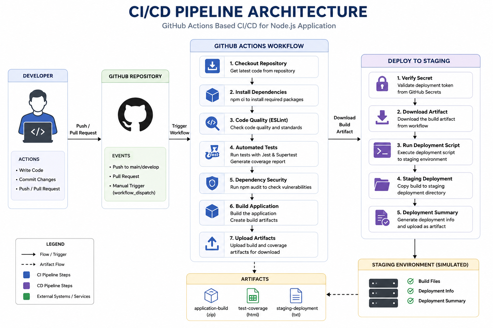
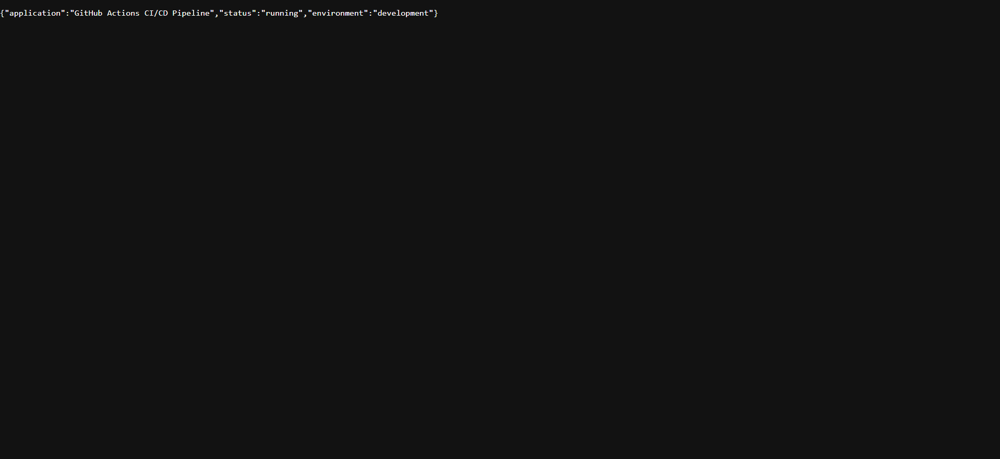
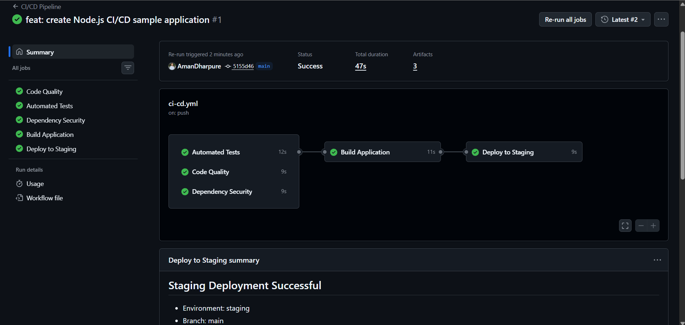
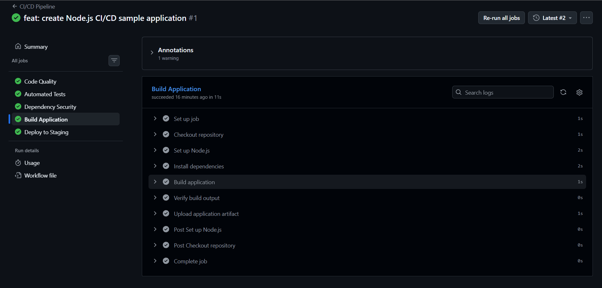
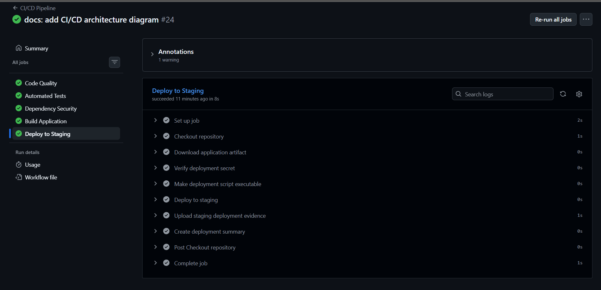
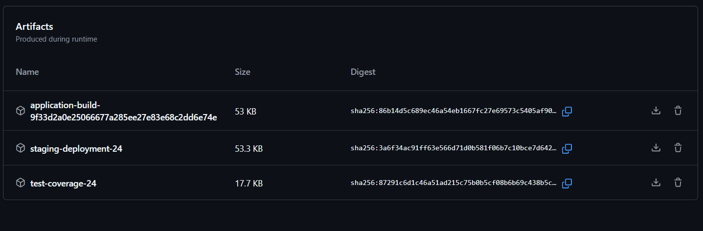

# 🚀 Production-Ready CI/CD Pipeline Automation with GitHub Actions

## Overview

This project demonstrates a **production-style Continuous Integration and Continuous Deployment (CI/CD) pipeline** built using **GitHub Actions** for a Node.js Express application.

The pipeline automatically validates code quality, executes automated tests, builds the application, performs dependency security checks, uploads build artifacts, and simulates deployment to a staging environment. It follows modern DevOps practices such as automation, secure secret management, artifact handling, and workflow-based deployments.

---

## Objectives

* Automate software delivery using GitHub Actions.
* Implement Continuous Integration (CI) best practices.
* Simulate Continuous Deployment (CD) to a staging environment.
* Demonstrate secure handling of environment variables and secrets.
* Build a production-style DevOps workflow suitable for real-world projects.

---

## Features

* ✅ Automated GitHub Actions workflow
* ✅ Dependency installation
* ✅ ESLint code quality checks
* ✅ Automated testing with Jest & Supertest
* ✅ Dependency security audit
* ✅ Automated application build
* ✅ Build artifact upload
* ✅ Simulated staging deployment
* ✅ Environment-based secret management
* ✅ Deployment summary generation
* ✅ Clean project structure
* ✅ Professional documentation

---

## Tech Stack

| Category        | Technology      |
| --------------- | --------------- |
| Runtime         | Node.js         |
| Framework       | Express.js      |
| CI/CD           | GitHub Actions  |
| Testing         | Jest, Supertest |
| Linting         | ESLint          |
| Package Manager | npm             |
| Version Control | Git & GitHub    |

---

## Project Structure

```text
github-actions-cicd-pipeline/
│
├── .github/
│   └── workflows/
│       └── ci-cd.yml
│
├── scripts/
│   ├── build.js
│   └── deploy-staging.sh
│
├── src/
│   ├── app.js
│   └── server.js
│
├── tests/
│   └── app.test.js
│
├── .env.example
├── .gitignore
├── eslint.config.js
├── package.json
├── package-lock.json
└── README.md
```

---

# CI/CD Pipeline Workflow

```text
Developer
     │
     ▼
Push / Pull Request
     │
     ▼
GitHub Repository
     │
     ▼
GitHub Actions
     │
     ├── Install Dependencies
     ├── Run ESLint
     ├── Execute Tests
     ├── Dependency Security Audit
     ├── Build Application
     ├── Upload Build Artifact
     └── Deploy to Staging
```

---

# Pipeline Stages

### 1. Checkout Repository

The workflow checks out the latest version of the source code.

---

### 2. Install Dependencies

All required Node.js packages are installed using:

```bash
npm ci
```

---

### 3. Code Quality

ESLint analyzes the project for coding standard violations.

```bash
npm run lint
```

---

### 4. Automated Testing

Jest and Supertest execute API tests.

```bash
npm test
```

The workflow generates a test coverage report.

---

### 5. Security Audit

The pipeline checks project dependencies for known vulnerabilities.

```bash
npm audit --audit-level=high
```

---

### 6. Build Application

The build script prepares the application for deployment.

```bash
npm run build
```

A build artifact is created and uploaded for later deployment.

---

### 7. Deploy to Staging

Instead of deploying to a cloud platform, the project performs a **simulated staging deployment**.

The deployment script:

* validates build files
* copies the build to a staging directory
* creates deployment metadata
* verifies successful deployment
  
# 🏗️ Architecture

The diagram below illustrates the complete GitHub Actions CI/CD workflow implemented in this project.


---
## 📸 Screenshots

### Application Home Page


### Health Endpoint


### Successful GitHub Actions Workflow


### Build Application Job


### Deploy to Staging Job


### Workflow Artifacts

## Local Setup

Clone the repository:

```bash
git clone https://github.com/<your-username>/github-actions-cicd-pipeline.git
```

Move into the project:

```bash
cd github-actions-cicd-pipeline
```

Install dependencies:

```bash
npm install
```

Run the application:

```bash
npm start
```

Open:

```
http://localhost:3000
```

---

## API Endpoints

### Home

```
GET /
```

### Health Check

```
GET /health
```

### Tasks

```
GET /api/tasks
```

---

## Available Scripts

Run the application:

```bash
npm start
```

Run ESLint:

```bash
npm run lint
```

Execute tests:

```bash
npm test
```

Build the project:

```bash
npm run build
```

---

## Environment Variables

Create a `.env` file using the following example:

```env
NODE_ENV=development
PORT=3000
```

---

## GitHub Environment Secret

The deployment workflow uses the following GitHub Environment Secret:

```
STAGING_DEPLOYMENT_TOKEN
```


## GitHub Actions Workflow

The workflow runs automatically on:

* Push to `main`
* Push to `develop`
* Pull Request to `main`
* Pull Request to `develop`


---

## Build Artifacts

The workflow uploads:

* Application Build
* Test Coverage
* Staging Deployment Evidence


---

## DevOps Best Practices Implemented

* Continuous Integration
* Continuous Deployment (Simulation)
* Infrastructure Automation
* Automated Testing
* Code Quality Enforcement
* Secure Secret Management
* Build Artifact Management
* Deployment Validation
* Branch-Based Workflow
* Version Control with Git

---
---

## Author

**Aman Dharpure**

* GitHub: https://github.com/AmanDharpure
* Role: Aspiring Cloud & DevOps Engineer

---


